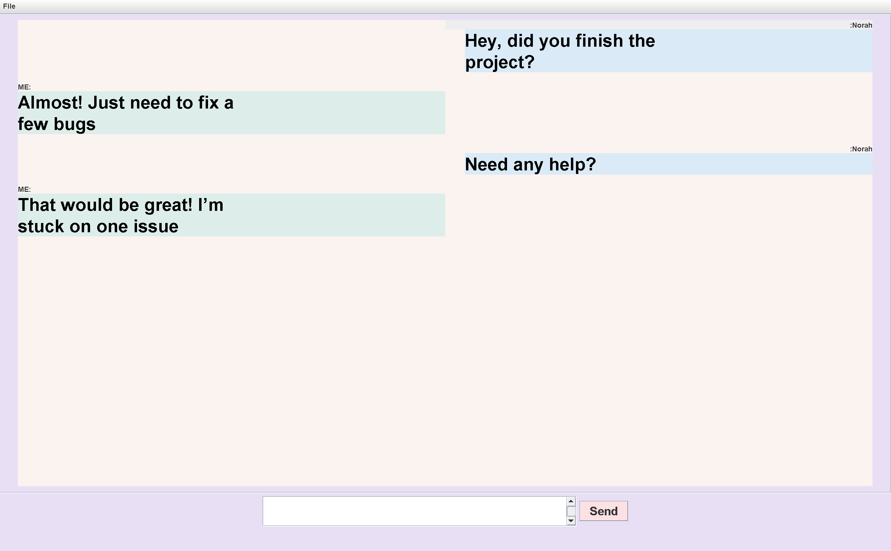

# TalkTik - A Simple Chat Application

**TalkTik** is a Java-based chat application that allows users to communicate in real-time through both **global chat** and **private messaging**. The application is built using Java Swing for the user interface and Java Sockets for client-server communication.

---

## Features

- **Global Chat**: Users can send messages to all connected clients in a global chat room.
- **Private Messaging**: Users can send private messages to specific clients by entering their username.
- **User Authentication**: Users must enter a unique username (1-10 characters) to join the chat.
- **Real-Time Communication**: Messages are sent and received in real-time using a client-server architecture.
- **User-Friendly Interface**: The application features a clean and intuitive GUI built with Java Swing.
- **Multiple Windows**: Users can open multiple private chat windows simultaneously.

---

## Technologies Used

- **Java**: Core programming language.
- **Java Swing**: For building the graphical user interface (GUI).
- **Java Sockets**: For client-server communication.
- **Multithreading**: To handle multiple clients simultaneously.

---

## Project Structure

The project is organized into the following packages and classes:

### Server Side
- **`Server.java`**: Handles incoming client connections, manages client handlers, and routes messages between clients.
- **`ClientHandler.java`**: Manages communication with individual clients, processes incoming messages, and sends responses.

### Client Side
- **`Client.java`**: The main client application that provides the user interface for chatting.
- **`Window.java`**: Represents a private chat window between two users.

---

## How to Run the Project

### Prerequisites
- **Java Development Kit (JDK)**: Ensure you have JDK 8 or higher installed.
- **IDE**: You can use any Java IDE (e.g., IntelliJ IDEA, Eclipse) or run the project from the command line.

### Steps to Run

1. **Clone the Repository**:
   ```bash
   git clone https://github.com/Raneem0Alyahya/TalkTik.git
   cd TalkTik
   ```

2. **Run the Server**:
   - Navigate to the `server` package.
   - Run the `Server.java` file.
   - The server will start on port `6789` by default.

3. **Run the Client**:
   - Navigate to the `client` package.
   - Run the `Client.java` file.
   - Enter a username when prompted (must be 1-10 characters long).

4. **Start Chatting**:
   - Use the **Global Chat** to send messages to all connected users.
   - Use the **Add new private chat** feature to start a private conversation with a specific user.

---

## Screenshots

### Global Chat


### Private Chat


### User Profile


---

## How It Works

### Server
- The server listens for incoming client connections on a specified port.
- Each client connection is handled by a separate `ClientHandler` thread.
- The server routes messages between clients based on the message type (global or private).

### Client
- The client connects to the server using a socket.
- The user interface is built using Java Swing, with separate panels for global chat, private chats, and user profile.
- Private chat windows are dynamically created when a user starts a private conversation.

---


Enjoy chatting with **TalkTik**! 🚀
